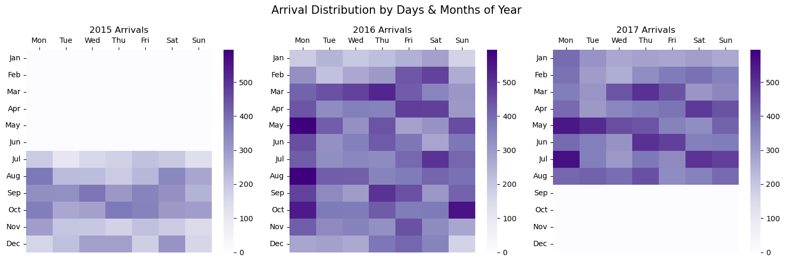
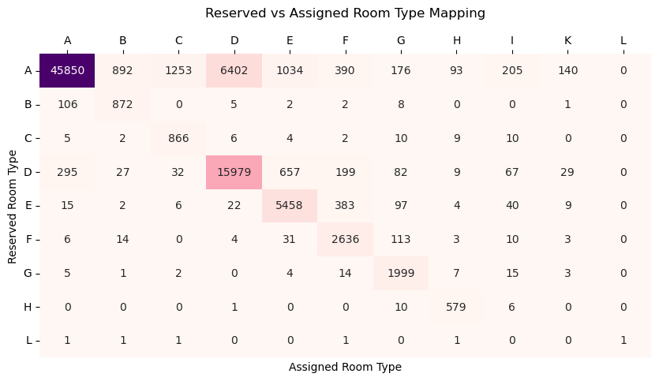
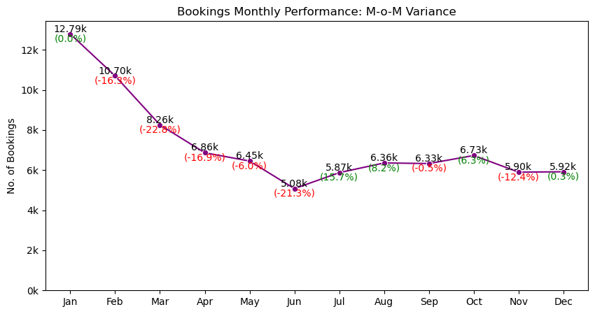
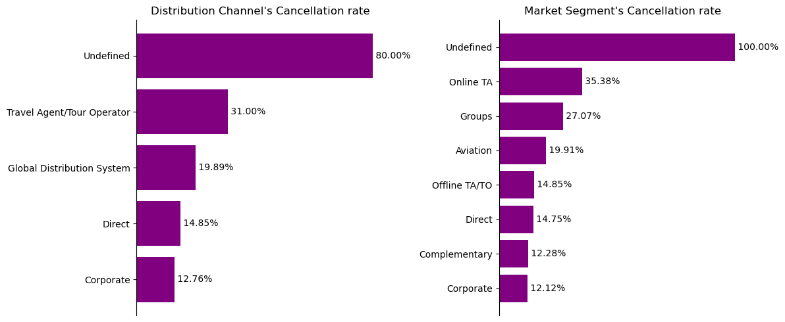
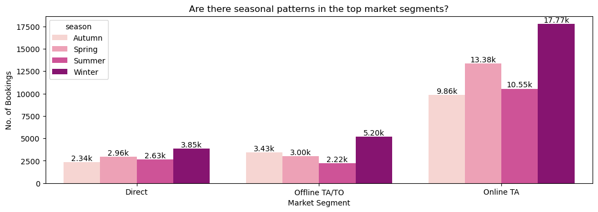

# 🏨 HOTEL BOOKING ANALYSIS

## 📘 Project Overview
This project explores and analyzes the **Hotel Booking Dataset**, which contains booking information for a **City Hotel** and a **Resort Hotel** between 2013 and 2017.    

Through exploratory data analysis (EDA), visualization, and feature-based insights, this project aims to uncover patterns in **booking behavior, arrivals and stays, cancellations, seasonality, guest profiles, revenue performance**,  answer key business questions and help the hotels get insights to make data-driven decisions.

## 🛠️ Tools & Libraries Used

| Category | Tools |
|:--|:--|
| Language | `Python` |
| Analysis Library | `Pandas`, `NumPy` |
| Visualization | `Matplotlib`, `Seaborn`, `Plotly` |
| Development and Reporting | `VSCode`, `Markdown` |
| Source Control and Sharing| `Git`, `GitHub` |


## 📂 Dataset Information

**Data File:** [Hotel Booking Dataset](<Hotel Bookings.csv>)  
**Size:** 119,390 rows × 33 columns  
**Scope:** Covers both City and Resort hotels, including details about reservations, arrival dates, lead times, stays, cancellation behavior, revenue, and guest demographics.


## 🧾 Data Dictionary (Key Columns)

| Column | Description |
|:--|:--|
| `hotel` | Type of hotel (`City Hotel` or `Resort Hotel`) |
| `is_canceled` | Whether the booking was canceled (1 = Yes, 0 = No) |
| `lead_time` | Number of days between booking and arrival date |
| `arrival_date_year`, `arrival_date_month`, `arrival_date_day_of_month` | Booking arrival details |
| `stays_in_weekend_nights` | Nights spent during weekends |
| `stays_in_week_nights` | Nights spent during weekdays |
| `adults`, `children`, `babies` | Number of guests per booking |
| `meal` | Type of meal booked (e.g., BB = Bed & Breakfast) |
| `country` | Country of guest origin |
| `market_segment` | How booking was made (e.g., Online TA, Direct) |
| `distribution_channel` | Booking distribution method |
| `is_repeated_guest` | Whether the guest has booked before (1 = Yes, 0 = No) |
| `previous_cancellations` | Number of previous cancellations |
| `reserved_room_type`, `assigned_room_type` | Room types booked and assigned |
| `deposit_type` | Type of deposit required (`No Deposit`, `Non Refund`, `Refundable`) |
| `agent`, `company` | IDs of travel agents or companies |
| `adr` | Average Daily Rate (total booking cost / total nights) |
| `reservation_status` | Final booking status (`Check-Out`, `Canceled`, `No-Show`) |
| `total_of_special_requests` | Number of special requests made |
| `customer_type` | Type of customer (`Transient`, `Contract`, `Group`, `Transient-Party`) |


## 🧹 Data Cleaning & Preparations

1. **Handled Missing Values and Abbrevated Entries**

   * Replaced nulls in key columns based on context:
     * `Agent` -> *"No agent"*
     * `Company` -> *"Not provided"*
     * `Country` -> *"Not provided"*
     * `Children` -> *0*
   * Replaced abbrevations in key columns for clarity:
     * `BB`: Bed & Breakfast
     * `FB`: Full Board
     * `HB`: Half Board
     * `SC`: Self Catering
     * `TA/TO`: Travel Agent/Tour Operator
     * `GDS`: Global Distribution System

2. **Converted and Adjusted Data Types**

   * Combined arrival columns into a single `arrival_date`.
   * Changed column data types as needed for analysis.

3. **Filtered Unreasonable or Incorrect Records:**

   * Removed bookings with zero guests or negative ADR values.

```python
# Remove records with 0 guest
htb = htb[(htb['adults'] + htb['children'] + htb['babies']) > 0]

# Ensure that there no negative adrs
htb = htb[htb['adr'] >= 0]

# Ensure that booking date >= arrival date
htb = htb[htb['lead_time'] >= 0]
```

4. **Created and Derived Columns:**

   * **`Booking Date`** derived using *‘Arrival Date’ - ‘Lead Time’*
   * `total_stay_nights` = `stays_in_weekend_nights + stays_in_week_nights`
   * `total_guests` = `adults + children + babies`
   * `amount` = `adr * total_stay_nights`
   * `revenue` = actualized revenue for valid stays or non-refundable cancellations

5. **Final Data Refinements:**

   * Dropped unnecessary columns.
   * Renamed columns and standardized value names for readability.
   * Checked for and removed duplicates.

All data cleaning steps can be found in the [Data Cleaning & Preparation Notebook](<0_Data_Cleaning_andPreparation.ipynb>). However, some of the transformations were done during the analysis process as needed and are found in other notebooks.
Here are some code snippets from during the data preparation phase:

***Creating Arrival Date***
```python
htb['arrival_date'] = pd.to_datetime(
    htb['arrival_date_year'].astype(str) + '-' + 
    htb['arrival_date_month'].astype(str) + '-' + 
    htb['arrival_date_day_of_month'].astype(str), 
    format="%Y-%B-%d"
    )
```

***Removing Duplicated Record***
```python
# Print no of duplicates before deleting them
print(f'Number of duplicates: {htb.duplicated().sum():,}')

# Remove duplicates from dataframe 'htb'
htb = htb.drop_duplicates()

# Print no of duplicates after deleting them
print(f'Number of duplicates after removal: {htb.duplicated().sum()}')
```

## 🎯 Analysis Areas

This analysis focused on five key areas:

📝 Bookings, Stay, Arrivals & Cancellations: Reviews booking volumes, hotel type distribution, cancellations, lead times, and guest origins.

⏰ Time-Based Analysis: Examines monthly and yearly trends, seasonality, and variations in ADR and cancellations over time.

👥 Guest Profile Analysis: Highlights guest composition, customer types, and booking preferences across hotels.

🔗 Booking Channels & Market Segments: Analyzes distribution channels, market segments, and their impact on ADR, lead time, and cancellations.

💰 Revenue & Performance Analysis: Evaluates revenue drivers, ADR behavior, and performance trends across hotels and time periods.

All questions for analysis can be found in the [Hotel Booking Questions Notebook](questions.txt)


## 📊 The Analysis Findings

### 📝 Exploratory Data Analysis - Bookings, Arrivals, Stays

Notebook Link: [EDA - Bookings & Arrivals](1_EDA-Bookings_Arrivals.ipynb)

A total of 87,299 valid bookings were recorded, with the City Hotel receiving about ~61% of all reservations. The Resort Hotel accounted for 33,955 bookings. From all bookings, 24,009 were canceled, resulting in an overall cancellation rate of approximately 27.5%.

The Average Lead Time across all bookings was 80 days, with canceled bookings having a significantly higher lead time (106 days) compared to non-canceled ones (70 days), suggesting that bookings with lead time approaching 100 days increases cancellation likelihood.

On an average, each booking has a length of 3 stay nights, with Resort Hotel bookings tending to be longer (4 nights) compared to City Hotel (2 nights). Additionally, week nights stays are more common (2 nights or more) than weekend stays (~1 night).

About 3.85% (3,363) of all bookings were made by repeated guests, with a lower cancellation rate (7.73%) compared to new guests (28.32%), indicating that loyalty reduces cancellation likelihood.

Most bookings came from Portugal (PRT), far exceeding other countries, suggesting a strong domestic or regional market presence. Additionally, Europe (Portugal, United Kingdom, France, Spain, Germany, Italy, Ireland, Belgium, Netherlands) accounted for the majority of bookings, indicating a strong European customer base.

Guest arrivals peaked in May, July and August, indicating a strong summer seasonality for both hotel types. Although both hotels shows similar wave trends over the months, the City Hotel experienced higher arrivals compared to the Resort Hotel. 

During the Autumn and Winter months, arrivals were generally lower, with a noticeable dip in November, December and January reinforcing the Q3 peak seasonality. Monday arrivals seems to be significantly higher, with dispersed arrivals on other days of the week.



The most frequently reserved room type was 'A', followed by 'D' and 'E'. While not all bookings were assigned the same room type as initially reserved, the majority matched, indicating efficient room allocation practices.
In a broader operational context, such insights can be used to monitor overbooking risks, track upgrade or downgrade patterns, and minimize customer dissatisfaction through improved inventory management.



---
### ⏰ Time-Based Analysis
Notebook Link: [Time-Based Analysis](2_Time_Based_Analysis.ipynb)

Across the years, January recorded the highest total number of bookings (12,786), peaking in 2017 with 6,254 reservations. 
Overall, there is a downward trend from February, reaching an all-time low of 5,077 bookings in June, which marks the mid-year dip in demand. From August onward, bookings begin to recover, maintaining a steady level of approximately 6,000–7,000 reservations per month until December, indicating a gradual resurgence toward the end of the year clearly reflecting a seasonal booking pattern with strong peaks at the start and end of the year.



```python
# Create a ordered list of month
month_order = ['Jan', 'Feb', 'Mar', 'Apr', 'May', 'Jun','Jul', 'Aug', 'Sep', 'Oct', 'Nov', 'Dec']

# Count no of bookings for each month, using the .dt to access the month name from 'booking_date'
monthly_bookings = (htb
                    .groupby(htb['booking_date'].dt.strftime('%b')) # Group by month name
                    .size() # Aggregate by count of rows 
                    .reindex(month_order) # Reaarange the index using the ordered month list
                    .to_frame(name='bookings') # Turn result to a dataframe and rename the count column
                    )

# Calculate Percentage Change, fill missing values with 0 and round to 2 decimal place
monthly_bookings['pct_change'] = (monthly_bookings['bookings'].pct_change().fillna(0)*100).round(2)

# Set plot size for wider width
plt.figure(figsize=(10,5))

# Plot a line chart
sns.lineplot(data=monthly_bookings, x=monthly_bookings.index, y=monthly_bookings['bookings'], color='purple', marker='o')

# Loop through row of data 'monthly_bookings'
for i, val in enumerate(monthly_bookings['bookings']):
     # Label each point on the chart
     plt.text(i, val, s=f'{val/1000:,.2f}k' if val >= 1000 else val, ha='center', va='bottom')

     # label with the percentage change value beneath the value
     plt.text(i, val, s=f'({monthly_bookings['pct_change'].iloc[i]:,.1f}%)', 
              color='red' if monthly_bookings['pct_change'].iloc[i] < 0 else 'green', ha='center', va='top')  # format color for pct_change 

# Plot styling: Remove excess frame and ticks, apply descriptive title and axis labels
plt.xlabel('')
plt.ylabel('No. of Bookings')
plt.ylim(0, monthly_bookings['bookings'].max()*1.05)   # set y-axis limit
plt.gca().yaxis.set_major_formatter(plt.FuncFormatter(lambda y, pos: f'{int(y/1000)}k')) # format the y-axis tick-lables
plt.title('Bookings Monthly Performance: M-o-M Variance')

plt.show()
```

Monthly cancellation rates showed minimal variation, with April (30.08%), July (29.27%), and May (29%) experiencing the highest levels of cancellations. This suggests a slight seasonal influence but no extreme month-to-month fluctuations.

The Average Daily Rate (ADR) over the years shows a generally upward trend from 2015 to 2017, suggesting possible adjustments in pricing strategies or a shift toward higher-value reservations. Across the years, ADR tends to rise around mid-year and decline toward the end of the year. This pattern may indicate pricing adjustments during periods of lower demand. With a correlation coefficient of -0.39 between ADR and the number of bookings, there appears to be a moderate negative relationship, suggesting that higher rates might be associated with slightly fewer bookings, though this relationship is not strongly definitive.

The ADR during weekends is almost similar to weekdays, with weekends slightly higher. This suggests that pricing strategies are consistent across the week.

In cancellation trends, 2014 shows the highest cancellation rate with about 70% of reservations. By volume, 2016 recorded the most cancellations (over 10,000), with the cancellation rate falling by about 1.7% in 2017(27.8%) versus 2016(29.42%).

---
### 👥 Guest Profile
Notebook Link: [Guest Profile Analysis](3_Guest_Profile.ipynb)

From all reservations, the average number of guests per booking is 2. A total of 176,997 guests were booked for stay including adults, children and babies. However, only 125,223 (70.75%) of them actually arrived for their stay, indicating a no-show (1,888 guests) and cancellation (49,876 guests) impact of 29.25%.

There were more guests in the city hotel, with 107,685 guests booked, but only 73,887 (68.60%) arrived consisting of 69,004 adults, 4,545 children and 328 babies.

In contrast, the resort hotel had less guests booked  (69,312) with a slightly higher arrival rate of 74.09% (51,356 guests).

```python
# Guest type distribution analysis
# Get guest data and Filter only guests that actually arrived (Check-Out)
guest_htb = htb[htb['reservation_status'] == 'Check-Out'][['hotel', 'adults', 'children', 'babies']]

# Unpivot guest data to long format for easy analysis
guest_count = guest_htb.melt(id_vars = 'hotel', value_vars=['adults', 'children', 'babies'], value_name='guest_count', var_name='guest_type')

# Get total guest count per type and hotel
hotel_guest_count = guest_count.groupby(['hotel', 'guest_type'])['guest_count'].sum().reset_index()

# Divide guest count by total arrived guest, xply by 100 and round to 2dp to get percentage of guest type per hotel
hotel_guest_count['guest_pct%'] = ((hotel_guest_count['guest_count'] / arrived_guest) * 100).round(2)

hotel_guest_count
```
Majority of guest across both hotels are first time visitors, accounting for 96.14% of all bookings. Repeated guests make up only 3.86% of bookings and have a significantly lower cancellation rate (7.73%) compared to new guests (28.32%), indicating that loyalty reduces cancellation likelihood.

Among customer types, 'Transient' guests bookings have the highest cancellation rate at 30.14%, while 'Group' bookings have the lowest at 9.8%, suggesting that group reservations are less prone to cancellations.

The Bed & Breakfast (BB) meal plan is the most popular choice among guests, reflecting a general preference for basic meal options. However, preferences differ between hotels: guests at the City Hotel tend to choose Self-Catering (SC) as their second most common option, while those at the Resort Hotel favor Half-Board (HB) as the next preferred choice. This suggests that City Hotel guests may prefer more flexibility in meals, whereas Resort Hotel guests lean toward convenience and inclusive dining experiences.

Similar to the overall booking pattern, guests from European countries, particularly Portugal, the United Kingdom, France, Germany, and Spain account for the highest accumulated length of stay. Portugal and the United Kingdom lead with the longest total stay durations, highlighting their strong market presence and consistent contribution to hotel occupancy.
Interestingly, guests from smaller markets such as Togo, Guinea-Bissau, the Bahamas, Palau, and Sierra Leone recorded some of the longest average stays, often exceeding seven nights per visit. This suggests that while their booking volume is relatively low, these markets represent valuable long-stay segments that could be strategically targeted for retention or loyalty programs.

Looking at the deposit behaviour of guest, while a very few donot mind making a non refundable deposit, majority prefer to not make a deposit at all. This is common across both hotel types. Naturally, one would infer that guest who make non-refundable deposits are less likely to cancel their bookings, but they have the highest cancellation rate(94.7%) compared to other deposit types, suggesting that other factors influence cancellation decisions beyond deposit.

---
### 🔗 Booking Channels & Market Segments
Notebook Link: [Booking Channels & Market Segments Analysis](4_Booking_Channels_and_Market_Segments.ipynb)

Most bookings were made through Travel Agent/Tour Operators, accounting for 79.13% of total reservations, highlighting the strong influence of intermediaries in hotel bookings. Direct bookings represent 14.85%, while Corporate bookings contribute a smaller share of 5.80%. The remaining channels, including Global Distribution System (GDS) and other unspecified sources, collectively account for less than 1%.

Similarly, the Market Segment distribution reveals that the Online Travel Agent segment dominates with 59.10% of total bookings, emphasizing the importance of digital platforms in driving hotel demand. The Offline Travel Agent/Tour Operator segment follows at 15.88%, further highlighting the continued relevance of agent-driven reservations alongside online growth. Although segments like Corporate (4.81%), Group (5.64%), Complementary (0.79%), and Aviation (0.26%) represent smaller distinct market contributors, it reflects a well-diversified mix of booking sources.

Analysis of cancellation rates reveals that bookings with unknown sources recorded the highest cancellation rate, followed by those made through agents, which shows relatively high cancellations of around 30%. In contrast, Direct bookings (14.85%), GDS (19.89%), and Corporate (12.76%) channels exhibit significantly lower cancellation rates. This suggests that guests who book directly with the hotel or through corporate agreements tend to be more committed to their reservations, while agent-based bookings are more prone to cancellations.

```python
# Get Cancel Rate for Distribution Channel and Market Segment
channel_cancel = htb.groupby('distribution_channel')['is_canceled'].mean().sort_values()
segment_cancel = htb.groupby('market_segment')['is_canceled'].mean().sort_values()

# Set no. of subplots and plot size
fig, ax = plt.subplots(1,2, figsize=(12,5))

# Plot first chart on axis[0]
bar1 = ax[0].barh(channel_cancel.index, channel_cancel.values, color='purple')
ax[0].bar_label(bar1, labels=[f' {val*100:.2f}%' for val in bar1.datavalues])   # add bar labels
ax[0].set_title('Distribution Channel\'s Cancellation rate')    # set subplot title
ax[0].set_xticks([])    # remove ticks on x-axis

# Plot second chart on axis[1]
bar2 = ax[1].barh(segment_cancel.index, segment_cancel.values, color='purple')
ax[1].bar_label(bar2, labels=[f' {val*100:.2f}%' for val in bar2.datavalues])   # add bar labels
ax[1].set_title('Market Segment\'s Cancellation rate')  # set subplot title
ax[1].set_xticks([])    # remove ticks on x-axis

plt.tight_layout() # Auto adjust plot and elements to fix
sns.despine(bottom=True)    # Remove chart border

plt.show()
```


Bookings made through Travel Agents and Tour Operators tend to have the longest average lead times, reflecting early planning and structured travel arrangements. In contrast, Direct and Corporate channels typically exhibit shorter lead times, aligning with last-minute or business-driven reservations. Guests booking through Direct and Corporate channels also record lesser average stays (less than 3 days), compared to those booking via Travel Agents and Tour Operators, who tend to stay a bit longer.

Average Daily Rate (ADR) across booking channels shows little differences in pricing dynamics. The Global Distribution System (GDS) channel records the highest ADR at $119.73, followed by Undefined sources ($112.70) and Direct bookings ($107.77). The Travel Agent/Tour Operator (TA/TO) channel averages $104.11, while Corporate bookings have the lowest ADR at $67.32, likely reflecting negotiated corporate rates and long-term business relationships that secure discounted pricing.

A similar trend is observed across market segments, where  Direct, Online and Offline Travel Agent bookings maintain strong ADR performance, aligning with their volume-driven nature. Corporate and Group segments exhibit lower ADRs, consistent with their negotiated or bulk pricing structures. Meanwhile, complementary segments show the lowest ADR, as expected due to their suspected non-revenue generating nature.

Online Travel Agent (OTA) channels dominate bookings across all seasons, recording their highest volume in Winter (17,770), followed by Spring (13,377), Summer (10,549), and Autumn (9,857). Offline Travel Agent/Tour Operator (TA/TO) bookings also peak in Winter (5,195), likely reflecting structured travel packages that align with high-demand periods.

Direct bookings remain relatively stable throughout all seasons, reaching their highest in Winter (3,854) and lowest in Autumn (2,336), suggesting a consistent base of loyal or returning guests who prefer direct reservations regardless of season.

Overall, OTAs capture the largest share of seasonal demand, Offline TA/TO channels thrive during peak periods, and Direct bookings provide a somewhat steady stream of business year-round.



---
### 🪙 Revenue Performance
Notebook Link: [Revenue Analysis](5_Revenue_Performance.ipynb)

In calculating revenue, only bookings that resulted in actual stays (Check-Out) or non-refundable cancellations were included. This ensures that the reported figures accurately represent realized earnings, excluding potential revenue from canceled or unfulfilled reservations. By focusing on fulfilled stays and guaranteed payments, the analysis provides a more realistic and reliable view of the hotel’s financial performance.

```python
# Get total stay night
htb['total_stay_night'] = htb['stays_in_weekend_nights'] + htb['stays_in_week_nights']

# Get total amount per bookings
htb['amount'] = (htb['avg_daily_rate'] * htb['total_stay_night']).round(2)
```

```python
# Function to get actual revenue per booking based on 3 conditions
def actual_revenue(row):
    # If reservation status = Check Out
    if row['reservation_status'] == 'Check-Out':
        return row['amount']
    # If reservation status = Canceled but deposit type is Non Refundable
    elif row['reservation_status'] == 'Canceled' and row['deposit_type'] == 'Non Refund':
        return row['amount']  # hotel keeps payment
    # Otherwise return 0
    else:
        return 0

# Actual amount realized from booking
htb['revenue'] = htb.apply(actual_revenue, axis=1)

print(f'Total Revenue generated is ${htb['revenue'].sum():,.2f}')
```
A total revenue of $23,209,272.38 was generated from valid bookings, with the City Hotel contributing $12,344,046.78 (53.19%) and the Resort Hotel accounting for $10,865,225.60 (46.81%). The Average Daily Rate (ADR) across all bookings was $102.22, with the City Hotel recording a higher ADR of $108.64 compared to the Resort Hotel's $93.00.

Across the years, hotel revenue peaked in 2016 at $11.42M. Although 2017 records were incomplete (missing bookings from September to December), the year still demonstrated a strong performance, generating $6.70M, which already surpassed 2015’s total of $5.02M. The lowest revenue was recorded in 2014 at $74,143, which is expected given its lower booking volume (only 283 bookings). Overall, this pattern indicates a consistent upward trajectory in hotel revenue, reflecting steady business growth and improved market reach over the years.

Similar to bookings pattern, countries from Europe dominate revenue contributions, with Portugal leading at $5.08M, followed by the United Kingdom ($3.73M), France ($2.74M), Spain ($2.02M), and Germany ($1.62M). These top five countries collectively contribute a significant portion of the total revenue, highlighting their importance to the hotel's financial performance. Other notable contributors include Ireland, Italy, Belgium, Netherlands, Switzerland, Brazil, USA, China, Austria and Sweden.

There seem to be no direct correlation between Average Daily Rate (ADR) and Length of stay or Lead time. Bookings with longer lead times do not necessarily yield higher ADRs, indicating that early bookings do not always translate to premium pricing. Similarly, longer stays do not consistently result in higher ADRs, suggesting that pricing strategies are influenced by a broader set of variables.

Approximately 49.8% of bookings include at least one special request. As the number of special requests increases, the ADR shows a rising trend, peaking at $130.66 for bookings with five requests. This pattern suggests that guests with more specific needs or preferences are willing to pay higher rates, possibly reflecting a desire for enhanced comfort, customization, or premium services.

## 💡 Recommendations

Based on the findings across booking behavior, guest profiles, and revenue performance, the following recommendations are suggested to improve hotel operations, customer satisfaction, and overall profitability:

1. **Strengthen Direct Booking Channels**
Direct bookings have lower cancellation rates (14.85%) and competitive ADRs ($107.77). The hotel should invest in digital marketing, loyalty programs, and website user experience to encourage more direct reservations and reduce dependence on intermediaries such as travel agents.

2. **Leverage High-Value Markets**
Portugal, the United Kingdom, and France are key revenue drivers. Maintaining tailored promotions, language-specific offers, and loyalty incentives for these markets can help sustain and expand this customer base. Additionally, smaller long-stay markets (e.g., Togo, Guinea-Bissau, Bahamas) present opportunities for targeted retention programs.

3. **Reassess Agent-Driven Cancellations**
With Travel Agent/Tour Operator channels showing ~30% cancellation rates, it’s vital to review cancellation policies or introduce flexible but controlled terms to minimize lost revenue. Closer collaboration with agents can help improve booking quality and reduce overbooking risks.

4. **Optimize Pricing Strategies**
Since ADR shows little correlation with lead time or length of stay, hotels could benefit from implementing dynamic pricing models that factor in demand seasonality, booking channel, and customer type rather than relying on static rates.

5. **Enhance Guest Experience for Upselling**
The clear relationship between special requests and higher ADR suggests potential for premium upselling. Personalized service offers, early check-in packages, or room upgrades can be positioned toward guests who make multiple special requests.

6. **Balance Meal Plan Options Strategically**
The dominance of the Bed & Breakfast plan indicates guests’ preference for flexibility. However, since Resort guests favor Half-Board options, expanding inclusive or experiential dining packages could increase ADR and satisfaction in leisure segments.

7. **Seasonal and Operational Planning**
Given that arrivals peak in May–August and dip in winter, hotels should adjust staffing levels, promotional campaigns, and maintenance schedules accordingly. Offering winter discounts or local experience packages could help smooth occupancy throughout the year.

8. **Cancellation and Revenue Protection Strategy**
Bookings with longer lead times (averaging 106 days for canceled vs. 70 days for non-canceled) show a notably higher likelihood of cancellation. Interestingly, even “non-refundable” bookings exhibit cancellation rates exceeding 90%, suggesting gaps in enforcement or inconsistencies in how such reservations are processed.

To mitigate cancellation risks for bookings made 90+ days in advance, a tiered non-refundable structure can be implemented. This approach can help protect revenue by converting potential late cancellations into partial income while also freeing inventory earlier for resale.

## ⚠️ Limitations

* Room type labeling: Room types are coded as "A", "B", "C", etc., rather than descriptive names limiting interpretability.

* Missing Reason for Cancellation: The high cancellation rate of 27.5% is a major focus, but the dataset lacks a critical piece of information: why the guest canceled.

* Incomplete 2017 data: Bookings for September to December 2017 are missing, which may affect year-over-year comparisons/insights.

* Room availability tracking: The dataset does not include information on available rooms, making it difficult to assess overbooking risks.

Generally, it is important to note that the insights and recommendations provided are based solely on the available dataset and may not capture all real-world complexities as some assumptions were self-made. Further validation with additional data sources or business context would be of high significance if such analysis were to be used in a practical setting.

## ✍️ Author
**AbdulAzeez Adesanya**  
Data Analyst | Analytics Engineer Enthusiast<br> 
>📧 [adesanya240@gmail.com](mailto:adesanya240@gmail.com)  
>🌐 [LinkedIn](https://www.linkedin.com/in/abdulazeezadesanya)


