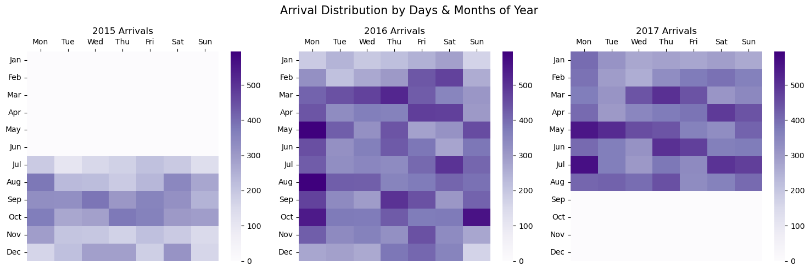

# 🏨 HOTEL BOOKING ANALYSIS

## 📘 Project Overview
This project explores and analyzes the **Hotel Booking Dataset**, which contains booking information for a **City Hotel** and a **Resort Hotel** between 2013 and 2017.    

Through exploratory data analysis (EDA), visualization, and feature-based insights, this project aims to uncover patterns in **booking behavior, arrivals and stays, cancellations, seasonality, guest profiles, revenue performance**,  answer key business questions and help the hotels get insights to make data-driven decisions.

## 🛠️ Tools & Libraries Used

| Category | Tools |
|:--|:--|
| General Language | `Python` |
| Data Analysis | `Pandas`, `NumPy` |
| Visualization | `Matplotlib`, `Seaborn`, `Plotly` |
| Development and Reporting | `VSCode`, `Markdown` |
| Source Control and Sharing| `Git`, `GitHub` |


## 📂 Dataset Information

**Data File:** [Hotel Booking Dataset](Hotel Bookings.csv)  
**Size:** 119390 rows × 33 columns  
**Scope:** Covers both City and Resort hotels, including details about reservations, arrival dates, lead times, stays, cancellation behavior, revenue, and guest demographics.


## 🧾 Data Dictionary (Key Columns)

| Column | Description |
|:--|:--|
| `hotel` | Type of hotel (`City Hotel` or `Resort Hotel`) |
| `is_canceled` | Whether the booking was canceled (1 = Yes, 0 = No) |
| `lead_time` | Number of days between booking and arrival date |
| `arrival_date_year`, `arrival_date_month`, `arrival_date_day_of_month` | Booking arrival details |
| `stays_in_weekend_nights` | Nights spent during weekends |
| `stays_in_week_nights` | Nights spent during weekdays |
| `adults`, `children`, `babies` | Number of guests per booking |
| `meal` | Type of meal booked (e.g., BB = Bed & Breakfast) |
| `country` | Country of guest origin |
| `market_segment` | How booking was made (e.g., Online TA, Direct) |
| `distribution_channel` | Booking distribution method |
| `is_repeated_guest` | Whether the guest has booked before (1 = Yes, 0 = No) |
| `previous_cancellations` | Number of previous cancellations |
| `reserved_room_type`, `assigned_room_type` | Room types booked and assigned |
| `deposit_type` | Type of deposit required (`No Deposit`, `Non Refund`, etc.) |
| `agent`, `company` | IDs of travel agents or companies |
| `adr` | Average Daily Rate (total booking cost / total nights) |
| `reservation_status` | Final booking status (`Check-Out`, `Canceled`, `No-Show`) |
| `total_of_special_requests` | Number of special requests made |
| `customer_type` | Type of customer (`Transient`, `Contract`, `Group`, `Transient-Party`) |


## 🧹 Data Cleaning & Preparations

1. **Handled Missing Values and Abbrevated Entries**

   * Replaced nulls in key columns based on context:
     * `Agent` -> *"No agent"*
     * `Company` -> *"Not provided"*
     * `Country` -> *"Not provided"*
     * `Children` -> *0*
   * Replaced abbrevations in key columns for clarity:
     * `BB`: Bed & Breakfast
     * `FB`: Full Board
     * `HB`: Half Board
     * `SC`: Self Catering
     * `TA/TO`: Travel Agent/Tour Operator
     * `GDS`: Global Distribution System

2. **Converted and Adjusted Data Types**

   * Combined arrival columns into a single `arrival_date`.
   * Changed column data types as needed for analysis.

3. **Filtered Unreasonable or Incorrect Records:**

   * Removed bookings with zero guests or negative ADR values.

4. **Created and Derived Columns:**

   * **`Booking Date`** derived using *‘Arrival Date’ - ‘Lead Time’*
   * `total_stay_nights` = `stays_in_weekend_nights + stays_in_week_nights`
   * `total_guests` = `adults + children + babies`
   * `amount` = `adr * total_stay_nights`
   * `revenue` = actualized revenue for valid stays or non-refundable cancellations

5. **Final Data Refinements:**

   * Dropped unnecessary columns.
   * Renamed columns and standardized value names for readability.
   * Checked for and removed duplicates.

All data cleaning steps can be found in the [Data Cleaning & Preparation Notebook](<0_Data_Cleaning_andPreparation.ipynb>). However, some of the transformations were done during the analysis process as needed and are found in other notebooks.
Here are some key code snippets used during data cleaning:

### 🗓️ Creating Arrival Date
```python
htb['arrival_date'] = pd.to_datetime(
    htb['arrival_date_year'].astype(str) + '-' + 
    htb['arrival_date_month'].astype(str) + '-' + 
    htb['arrival_date_day_of_month'].astype(str), 
    format="%Y-%B-%d"
    )
```

### Removing Duplicated Record
```python
# Print no of duplicates before deleting them
print(f'Number of duplicates: {htb.duplicated().sum():,}')

# Remove duplicates from dataframe 'htb'
htb = htb.drop_duplicates()

# Print no of duplicates after deleting them
print(f'Number of duplicates after removal: {htb.duplicated().sum()}')
```
---
## 🎯 Analysis Areas

This analysis focused on five key areas:

📅 Bookings, Stay, Arrivals & Cancellations: Reviews booking volumes, hotel type distribution, cancellations, lead times, and guest origins.

⏰ Time-Based Analysis: Examines monthly and yearly trends, seasonality, and variations in ADR and cancellations over time.

👥 Guest Profile Analysis: Highlights guest composition, customer types, and booking preferences across hotels.

🔗 Booking Channels & Market Segments: Analyzes distribution channels, market segments, and their impact on ADR, lead time, and cancellations.

💰 Revenue & Performance Analysis: Evaluates revenue drivers, ADR behavior, and performance trends across hotels and time periods.

All questions for analysis can be found in the [Hotel Booking Questions Notebook](questions.txt)

---
## 📊 The Analysis Findings

### 📝 Exploratory Data Analysis - Bookings, Arrivals, Stays

Notebook Link: [EDA - Bookings & Arrivals](1_EDA-Bookings_Arrivals.ipynb)

A total of valid 87,299 bookings were recorded, with the City Hotel receiving about ~61% of all reservations. The Resort Hotel accounted for 33,955 bookings. From all bookings, 24,009 were canceled, resulting in an overall cancellation rate of approximately 27.5%.

The Average Lead Time across all bookings was 80 days, with canceled bookings having a significantly higher lead time (106 days) compared to non-canceled ones (70 days), suggesting that bookings with lead time approaching 100 days increases cancellation likelihood.

On an average, each booking has a length of 3 stay nights, with Resort Hotel bookings tending to be longer (4 nights) compared to City Hotel (2 nights). Additionally, week nights stays are more common (2 nights or more) than weekend stays (~1 night).

About 3.85% (3,363) of all bookings were made by repeated guests, with a lower cancellation rate (7.73%) compared to new guests (28.32%), indicating that loyalty reduces cancellation likelihood.

Most bookings came from Portugal (PRT), far exceeding other countries, suggesting a strong domestic or regional market presence. Additionally, Europe (Portugal, United Kingdom, France, Spain, Germany, Italy, Ireland, Belgium, Netherlands) accounted for the majority of bookings, indicating a strong European customer base.

Guest arrivals peaked in May, July and August, indicating a strong summer seasonality for both hotel types. Although both hotels shows similar wave trends over the months, the City Hotel experienced higher arrivals compared to the Resort Hotel. 

During the Autumn and Winter months, arrivals were generally lower, with a noticeable dip in November, December and January reinforcing the Q3 peak seasonality. Monday arrivals seems to be significantly higher, with dispersed arrivals on other days of the week.



The most frequently reserved room type was 'A', followed by 'D' and 'E'. While not all bookings were assigned the same room type as initially reserved, the majority matched, indicating efficient room allocation practices.
In a broader operational context, such insights can be used to monitor overbooking risks, track upgrade or downgrade patterns, and minimize customer dissatisfaction through improved inventory management.


---
### ⏰ Time-Based Analysis
Notebook Link: [Time-Based Analysis](2_Time_Based_Analysis.ipynb)

Across the years, January had the highest total number of bookings (12,786) reaching a peak in 2017 with 6,254 reservations. Overall, there is a downward trend in bookings from February hitting an all time low of 5,077 in June, followed by a steady increase from August maintaining approximately 6000 - 7000 bookings till December.

```python
# Create a ordered list of month
month_order = ['Jan', 'Feb', 'Mar', 'Apr', 'May', 'Jun','Jul', 'Aug', 'Sep', 'Oct', 'Nov', 'Dec']

# Count no of bookings for each month, using the .dt to access the month name from 'booking_date'
monthly_bookings = (htb
                    .groupby(htb['booking_date'].dt.strftime('%b')) # Group by month name
                    .size() # Aggregate by count of rows 
                    .reindex(month_order) # Reaarange the index using the ordered month list
                    .to_frame(name='bookings') # Turn result to a dataframe and rename the count column
                    )

# Calculate Percentage Change, fill missing values with 0 and round to 2 decimal place
monthly_bookings['pct_change'] = (monthly_bookings['bookings'].pct_change().fillna(0)*100).round(2)

# Set plot size for wider width
plt.figure(figsize=(10,5))

# Plot a line chart
sns.lineplot(data=monthly_bookings, x=monthly_bookings.index, y=monthly_bookings['bookings'], color='purple', marker='o')

# Loop through row of data 'monthly_bookings'
for i, val in enumerate(monthly_bookings['bookings']):
     # Label each point on the chart
     plt.text(i, val, s=f'{val/1000:,.2f}k' if val >= 1000 else val, ha='center', va='bottom')

     # label with the percentage change value beneath the value
     plt.text(i, val, s=f'({monthly_bookings['pct_change'].iloc[i]:,.1f}%)', 
              color='red' if monthly_bookings['pct_change'].iloc[i] < 0 else 'green', ha='center', va='top')  # format color for pct_change 

# Plot styling: Remove excess frame and ticks, apply descriptive title and axis labels
plt.xlabel('')
plt.ylabel('No. of Bookings')
plt.ylim(0, monthly_bookings['bookings'].max()*1.05)   # set y-axis limit
plt.gca().yaxis.set_major_formatter(plt.FuncFormatter(lambda y, pos: f'{int(y/1000)}k')) # format the y-axis tick-lables
plt.title('Bookings Monthly Performance: M-o-M Variance')

plt.show()
```

Monthly cancellation rates showed minimal variation, with April (30.08%), July (29.27%), and May (29%) experiencing the highest levels of cancellations. This suggests a slight seasonal influence but no extreme month-to-month fluctuations.

The Average Daily Rate (ADR) over the years has positively trended upwards from 2015 to 2017, especially during peak booking months, indicating increasing reservations or pricing strategies. However, there are noticeable dips in ADR at the end of each year, reflecting bookings low periods.

The ADR during weekends is almost similar to weekdays, with weekends slightly higher. This suggests that pricing strategies are consistent across the week.

Looking at Cancellation over the years, 


---
### 👥 Guest Profile
Notebook Link: [Guest Profile Analysis](3_Guest_Profile.ipynb)

### 🔗 Booking Channels & Market Segments


### 💰 Revenue & Performance


---

## 💡 Recommendations


## ✍️ Author

**AbdulAzeez Adesanya**  
Data Analyst<br> 
>📧 [adesanya240@gmail.com](mailto:adesanya240@gmail.com)  
>🌐 [LinkedIn](https://www.linkedin.com/in/abdulazeezadesanya)


